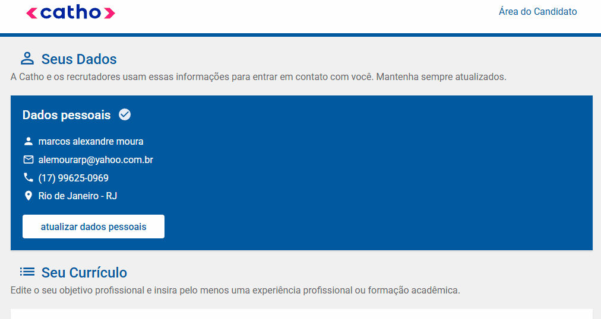

# Uma página teste / profissional!
Criando uma página teste com meu portifólio!🚀💪


[]

## Tecnologias utilizadas

- HTML
- CSS
- JS

## Como utilizar

Clone para o projeto
```
git clone <https://github.com/alemourarp/repositorio-com-readme.git>
```

Acesse a pasta do projeto
```
cd repositorio-com-readme
```
